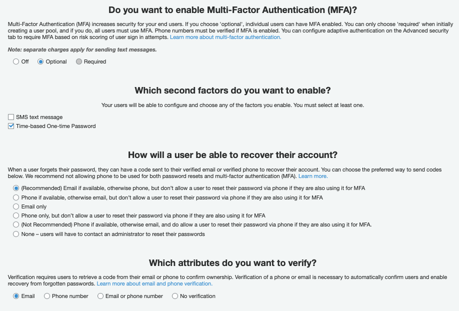

# django-rest-microservice

This package is built on the 
[djangorestframework-simplejwt](https://github.com/jazzband/djangorestframework-simplejwt) package, which provides
some JWT authentication mechanisms with [Django REST framework](https://github.com/encode/django-rest-framework).
This package offers the following features:
- Provides refresh cookie in HttpOnly cookie, and access token in response body, for better security 
when implemented properly with SPA.
- Provides an easier approach to customizing token claims than the standard mechanism described in 
djangorestframework-simplejwt documentation.
- Provides a mechanism for authentication with a third-party IDP, before issuing internal JWT to your users.
- Currently, supports authentication with AWS Cognito using OAuth 2 Code Grant with PKCE for best security practices.

Installation
============
Install package to environment:
```commandline
pip install django-rest-microservice
```
In the main urls.py, include the default package url routes:
```python
from django.urls import path, include

urlpatterns = [
    path("auth/", include("rest_framework_microservice.urls"))
]
```

In Django settings, include the following:
```python

INSTALLED_APPS = [
    ...,
    'rest_framework_microservice',
]

REST_FRAMEWORK = {
    'DEFAULT_AUTHENTICATION_CLASSES': (
        'rest_framework_simplejwt.authentication.JWTTokenUserAuthentication',
    )
}
```

For log off / token black listing feature to work, you also need to include the following in django settings:
```python
INSTALLED_APPS = [
    ...,
    'rest_framework_simplejwt.token_blacklist'
]
```
and then run django migrations.

REST API endpoints
==================

``{{domain}}/auth/sign-in/``
-------------------------
Sign in directly against Django backend using username and password, retrieves access token and response body and 
refresh token as HttpOnly cookie. The response body also contains a CSRF_token, which matches the same token set
in the HttpOnly cookie.
```commandline
curl --location --request POST '127.0.0.1:8000/auth/sign-in/' \
--header 'Content-Type: application/json' \
--data-raw '{
    "username": "admin",
    "password": "admin"
}'
```

``{{domain}}/auth/social-exchange/``
------------------------------------
Submits JWT tokens from an IDP (AWS Cognito), and in exchange for JWT tokens issue by Django server.
This will create a Django user if it does not already exist in the database. The response is the same as `sign-in`
endpoint above.
```commandline
curl --location --request POST '127.0.0.1:8000/auth/social-exchange/' \
--header 'Authorization: Bearer jwt_token_string \
--header 'Content-Type: application/json' \
--data-raw '{
    "id_token": "id_token_from_idp",
    "access_token": "access_token_from_idp",
    "refresh_token": "refresh_token_from_idp",
    "expires_in": 300,
    "token_type": "Bearer"
}'
```

``{{domain}}/auth/refresh/``
----------------------------
This endpoint accepts the refresh token and csrf token in HttpOnly cookies, and return an access token in response body.
```commandline
curl --location --request POST '127.0.0.1:8000/auth/refresh/' \
--header 'Authorization: Bearer jwt_token_string \
--header 'Content-Type: application/json' \
--data-raw '{
    "CSRF_token": "csrf_token"
}'
```

``{{domain}}/auth/logoff/``
--------------------------
This endpoint requires `rest_framework_simplejwt.token_blacklist` to have been installed.
Call this endpoint to blacklist the current refresh token.
```commandline
curl --location --request POST '127.0.0.1:8000/auth/logoff/' \
--header 'Authorization: Bearer jwt_token_string \
--header 'Content-Type: application/json' \
--data-raw '{
    "CSRF_token": "csrf_token"
}'
```

Settings
========
Settings are specified in Django settings.py under `REST_FRAMEWORK_MICROSERVICE`, the defaults are
the following:
```python
REST_FRAMEWORK_MICROSERVICE = {
    "REFRESH_COOKIE_NAME": "refresh_cookie",
    "REFRESH_COOKIE_PATH": "/auth",
    "IDP": {
        "PROVIDER": "aws",
        "REGION": "us-west-2",
        "USER_POOL": "us-west-2_abcdefg",
        "CLIENT_ID": "abcdefg",
    },
    "CUSTOM_TOKEN_USER_ATTRIBUTES": [],
    "CUSTOM_TOKEN_CALLABLE_ATTRIBUTES": [],
    "COOKIE_SALT": "extra",
    "USER_SERIALIZER_CLASS": None,
    "USER_MODEL_UUID_FIELD": None,
}
```

``REFRESH_COOKIE_NAME``
-----------------------
Name of refresh cookie to set in HTTP header.


``REFRESH_COOKIE_PATH``
-----------------------
URL path of refresh cookie, this should be a string that starts with a slash, ie: "/auth". This path 
needs to match the path of authentication endpoint path set in urls.py.


``IDP``
-----------------
A dictionary containing IDP attributes:
- ``PROVIDER``: a string identifying what IDP backend to use, defaults to `'aws'` 
(Currently only AWS Cognito is supported.)
- ``REGION``: user pool region.
- ``USER_POOL``: user pool identifier used with the IDP.
- ``CLIENT_ID``: IDP client id for your application.


``CUSTOM_TOKEN_USER_ATTRIBUTES``
--------------------------------

The list of Django user attributes to be copied to token as claims. i.e.: ``['is_active',]``.

``CUSTOM_TOKEN_CALLABLE_ATTRIBUTES``
------------------------------------

This is used to customize claims which cannot be done by simply using ``CUSTOM_TOKEN_USER_ATTRIBUTES`` setting.
This should be a list of dictionaries containing ``attr_name`` and ``attr_getter``.
i.e. : ``[{'attr_name': 'preferences', 'attr_getter': 'my_module.some_file.get_user_preferences'}, ...]``

The function specified in ``attr_getter`` should accept an argument of a Django user instance.

``COOKIE_SALT``
---------------
Salt to be used when signing cookie.

``USER_SERIALIZER_CLASS``
-------------------------
Defaults to None. If specified, the default view serializers will try to add a user object representing the user.
The content of the user object is defined by ``USER_SERIALIZER_CLASS``.

``USER_MODEL_UUID_FIELD``
-------------------------
Defaults to None. Used to specify a field on the Django user model that can be used to store UUID from IDP.


Customizing token claims
========================

You can include additional user attributes in the token claims by specifying them
in the ``CUSTOM_TOKEN_USER_ATTRIBUTES``.

You can also specify functions to return the value for custom claims by using
``CUSTOM_TOKEN_CALLABLE_ATTRIBUTES``.

```python
# settings.py
REST_FRAMEWORK_MICROSERVICE = {
  ...,
  'CUSTOM_TOKEN_CALLABLE_ATTRIBUTES': [
        {'attr_name': 'user_services',
         'attr_getter': 'my_module.token_claims.get_user_subscribed_services'
         }
    ]
}

# my_module.token_claims.py
def get_user_subscribed_services(user):
  return user.subscribed_services

```
If you are using `djangorestframework-simplejwt` version <= 5.0.0, you will also need to extend the 
`rest_framework_simplejwt.models.TokenUser` to include the additional claims. This is only applicable when using
[older versions](https://github.com/jazzband/djangorestframework-simplejwt/pull/528/).

```python
from functools import cached_property
from rest_framework_simplejwt.models import TokenUser

class CustomTokenUser(TokenUser):
    """
    Extend TokenUser and adds custom attributes to be pulled from TokenUser.
    This class should be specified in Django settings SIMPLE_JWT.TOKEN_USER_CLASS
    """

    @cached_property
    def first_name(self):
        return self.token.get('first_name', None)
```
and include the following Django setting:
```python
SIMPLE_JWT = {
    'TOKEN_USER_CLASS': 'microservice.models.CustomTokenUser'
}
```

Third-party IDP
===============
This package currently supports Cognito as an identity provider.
You can use AWS Cognito Userpool to enable social authentication.
Screenshot below for an example of setting up Cognito with Google sign in.

### AWS Cognito Userpool configurations





### Google OAuth configurations


